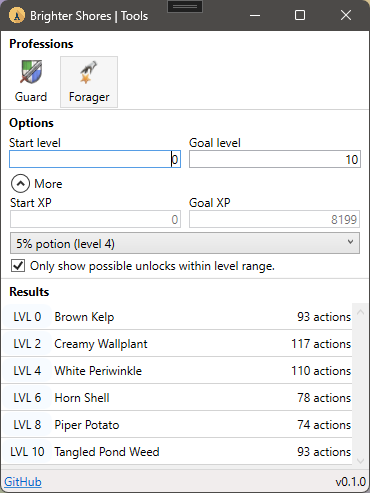

# Tools for Brighter Shores

> [!WARNING]
> This is very much a WIP repository. This code comes with no warranties. Use at own risk.

   

Tools for the MMORPG Brighter Shores &bullet; <a href="https://github.com/MichelMichels/brighter-shores-tools/issues">Report an issue</a>

## Getting started

- Grab the latest `.msi` from the [release page](https://github.com/MichelMichels/brighter-shores-tools/releases) and install.
- If you don't want to use my binaries, feel free to clone the whole project and generate your own with the setup project

## Status

Progress in implementing calculators:

| Episode  | Profession | Status |
| -------- | ---------- | :----: |
| Hopeport | Guard      |   🟩    |
| Hopeport | Chef       |   🟩    |
| Hopeport | Fisher     |   🟩    |
| Hopeport | Forager    |   🟩    |
| Hopeport | Alchemist  |   🟥    |

All data is dependent on the Brighter Shores wiki data.

## Suggestions

Please make use of the [issues page](https://github.com/MichelMichels/brighter-shores-tools/issues) to make suggestions. I must warn you, my time is limited and decision to implement something will be solely my own.